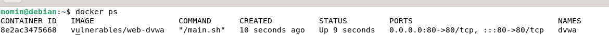
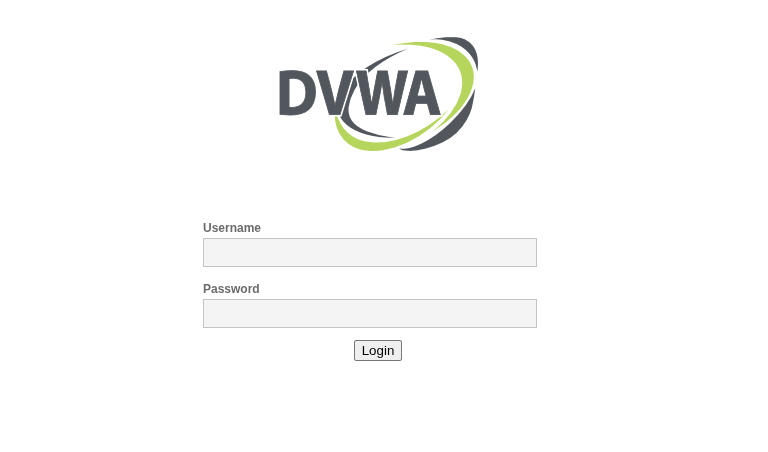
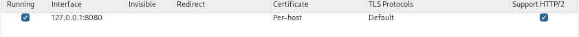
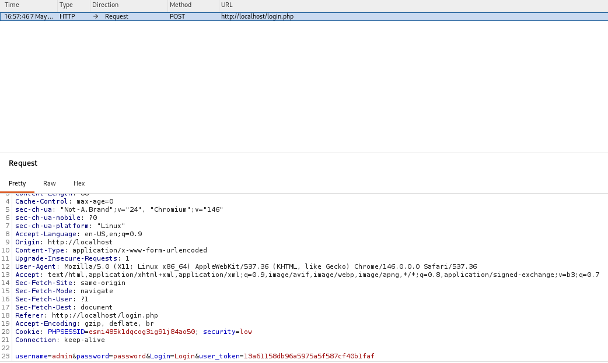
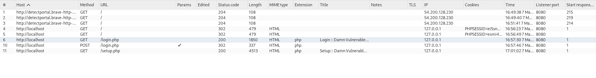
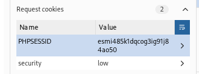
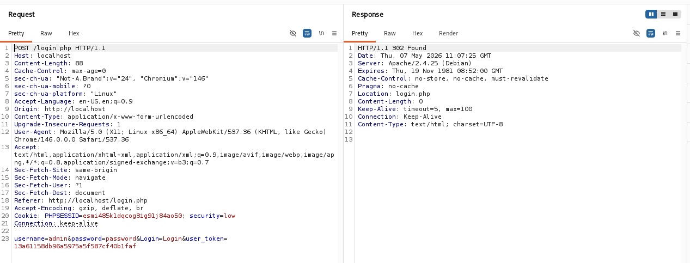
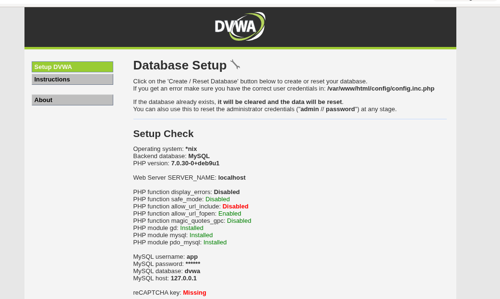

# 🔍 Local Web Server Deployment & HTTP Analysis

**Tools:** Docker · Debian Linux · Burp Suite · DVWA  
---

## 📌 Overview

Set up a deliberately vulnerable web application (DVWA) inside a Docker container on Debian Linux, then used Burp Suite to intercept and analyze HTTP traffic — including login requests, session cookies, and status codes.

---

## ⚙️ Setup

### 1. Run DVWA in Docker

```bash
docker pull vulnerables/web-dvwa
docker run -d -p 80:80 --name dvwa vulnerables/web-dvwa
docker ps
```



### 2. Access DVWA

Open browser → `http://localhost`  
Login: `admin` / `password`



### 3. Configure Burp Suite

- Open Burp Suite
- Go to **Proxy → Intercept → Open Browser**
- Turn **Intercept ON**



---

## 🔎 HTTP Traffic Analysis

### Intercepted Login POST Request

Logged into DVWA through Burp browser — captured the POST request:



**Key finding:** Username and password are visible in plaintext in the request body — no encryption.

---

### HTTP History



---

### Session Cookie (Set-Cookie Header)

After login, the server sets a session cookie in the response:



**Key finding:** Cookie has no `HttpOnly` or `Secure` flags — vulnerable to theft via XSS or network sniffing.

---

### Burp Repeater — Resending Requests

Used Repeater to manually resend and modify the login request:



---

### DVWA Dashboard After Login



---

## Key Findings

1. Credentials sent in **plaintext** — no HTTPS
2. Session cookie missing `HttpOnly` and `Secure` flags
3. Server exposes PHP version via `X-Powered-By` header
4. Session ID not rotated after login — session fixation risk

---

## What I Learned

- How Docker exposes containerized services on a local network
- How Burp Suite intercepts traffic between browser and server
- Structure of HTTP requests and responses
- How session cookies work and common misconfigurations
- How to use Burp Repeater to craft and resend requests

---

## Disclaimer

This project is for educational purposes only. All testing was done in a controlled local environment on a deliberately vulnerable application.

---

[note: if i made any mistake please lemme know. i am willing to learn-thank you ]
